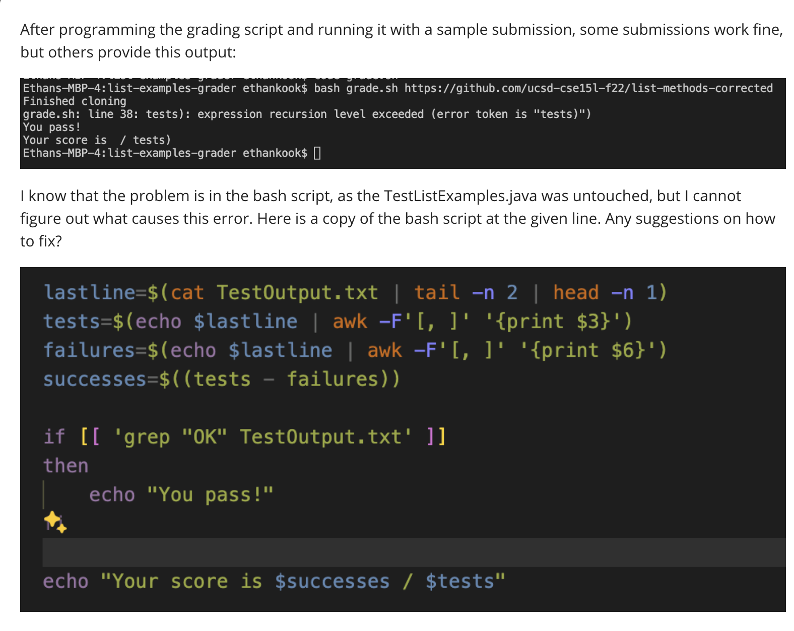
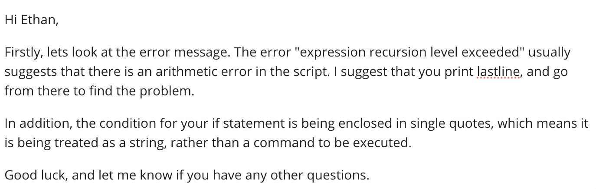
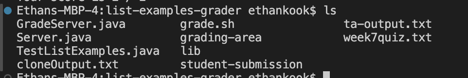
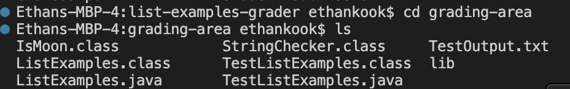

## Lab Report 5 - Putting it All Together (Week 9)
# Part 1 – Debugging Scenario

**EDSTEM POST:**




**TA RESPONSE:**



**FIXED CODE AND OUTPUT**

```
if grep -q "OK" TestOutput.txt
then 
    echo "You pass!"
    lastline=$(cat TestOutput.txt | tail -n 2 | head -n 1)
    tests=$(echo $lastline | awk -F'[()]' '{print $2}' | awk '{print $1}')
    echo "Your score is $tests / $tests"
else
    echo "You fail!"
    lastline=$(cat TestOutput.txt | tail -n 2 | head -n 1)
    tests=$(echo $lastline | awk -F'[, ]' '{print $3}')
    failures=$(echo $lastline | awk -F'[, ]' '{print $6}')
    successes=$((tests - failures))
    echo "Your score is $successes / $tests"
fi
```


After trying to print lastline, as the TA suggested, I realized that the bug only occurred for passed tests. Instead of having several fields describing the failed tests, it just states the number of tests passed and the time it takes. Because of this, the `awk` command does not work as intended and is not able to assign values to the tests, failures, and successes variables. 


**DIRECTORY STRUCTURE**



The images above show the structures of the relevant directories: list-exanmles-grader and grading-area.


**CONTENTS OF FILE BEFORE FIX**
```
CPATH='.:lib/hamcrest-core-1.3.jar:lib/junit-4.13.2.jar'

rm -rf student-submission
rm -rf grading-area

mkdir grading-area

git clone $1 student-submission 2> ta-output.txt
echo 'Finished cloning'

if ! [ -f student-submission/ListExamples.java ]
then
    echo "Missing necessary files!"
    exit
fi

cp TestListExamples.java student-submission/ListExamples.java grading-area
cp -r lib grading-area

cd grading-area

javac -cp $CPATH *.java

if [ $? -ne 0 ]
then 
    echo "Compilation error!"
    echo "You fail"
    exit
fi

javac -cp .:lib/hamcrest-core-1.3.jar:lib/junit-4.13.2.jar *.java
java -cp .:lib/hamcrest-core-1.3.jar:lib/junit-4.13.2.jar org.junit.runner.JUnitCore TestListExamples > TestOutput.txt


lastline=$(cat TestOutput.txt | tail -n 2 | head -n 1)
tests=$(echo $lastline | awk -F'[, ]' '{print $3}')
failures=$(echo $lastline | awk -F'[, ]' '{print $6}')
successes=$((tests - failures))

if [[ 'grep "OK" TestOutput.txt' ]]
then 
    echo "You pass!"
fi

echo "Your score is $successes / $tests"


```

**BUG FIX DESCRIPTION**

From the TA response, I tried printing the lastline variable, which printed "OK (2 Tests)". From this, I realized that the bug only happens for passed tests, so I edited the if statement to the following structure: 

```
if (passes)
then
  print $tests / $tests
else
  print $successes / $tests
fi
```
I used the `awk` command to isolate the number of tests in lastline, and set that number to the variable tests. Because the code worked fine for failed tests, I left the remaining code in the if loop alone. I also removed the single quotes from the if condition so the argument is treated as a command rather than a string.


# Part 2 - Reflection
Some of my favorite things I learned in the second half of the quarter were vim and jdb. Editing code in vim was a valuable experience and I found that the more I practiced, the better and faster I got at it. JDB, on the otherhand, was more confusing to me, but I felt a greater feeing of accomplishment after getting better at it. Another topic I learned from the second half of the quarter is using bash scripts. 

